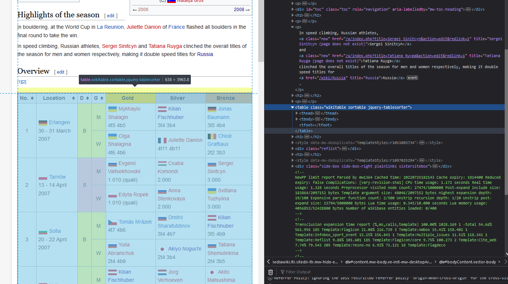

<!-- Something <kbd class="ctrl"></kbd>+<kbd class="cmd"></kbd> <kbd class="alt"></kbd> <kbd class="opt"></kbd> <kbd class="back"></kbd> <kbd class="shift"></kbd> <kbd class="enter"></kbd> <kbd class="tab"></kbd> <kbd class="win"></kbd> -->

I'll start this post with a little bit of background on why I made the visualisation in the first place.
Now, I am _really_ into climbing.
Though I'm not particularly good at it, I do it quite a bit.
I'm into it so much that I've been watching pretty much all the top-tier climbing competitions for the past few years.
So, when I decided to find some data and do something fun with it in order to build up my data science portfolio after I quit being a uni teacher, climbing data were the obvious choice.
I didn't know what kind of data I would be able to get or what I would do once I have them but I was quite excited.

The fun thing about projects like these is that you end up not only exercising your creative, design, and analytical skills but also learning something new about the subject matter.
For example, I always knew that [Akiyo Noguchi](https://en.wikipedia.org/wiki/Akiyo_Noguchi) was pretty amazing, but playing with the app made me learn more about _quite how amazing_ she was[^1].

## Finding Data

There is no one right way of going about a project like this.
You can, if you wish, start at the drawing board and design the end product and then figure out how to make it.
Like I said, in my case, I didn't have anything in particular in mind.
Instead, I decided to look at what data can be found out there and how I can get my greedy hands on it trusting that an idea will follow.

Let's find ourselves some data then, shall we?

Now, in an ideal world, I'd be pointing you to the website of the [International Federation of Sport Climbing](https://www.ifsc-climbing.org/index.php), the organising body behind all top-tier climbing competitions.
I'd be signposting their [results service](https://ifsc.results.info/#/), where you can find all official score boards from all of these competitions since 1990 and I'd be showing you how to pull all this tasty data from it.
Sadly, in our actual world, these websites have terms and conditions that are not exactly welcoming to automated tools and don't allow web scraping, not even for educational purposes, it seems. :disappointed:

And so, as the next best thing, let's look at the [Wikipedia page of the climbing world cup](https://en.wikipedia.org/wiki/IFSC_Climbing_World_Cup)[^2]:

<iframe class="lazy" data-src="https://en.wikipedia.org/wiki/IFSC_Climbing_World_Cup" height="400">
</iframe>

In the left hand side box on the page embedded above, you can see that each edition of the IFSC Climbing World Cup from 2007 has a wikipedia page.
That's really handy because, provided the pages are formatted reasonably uniformly, we should be able to relatively easily scrape them for the data we want.
Do these pages contain data of interest though?
Let's find out...

If you navigate to the page for the 2007 world cup, you'll see that the Overview section presents a nice table of results.
Each multi-row of the table contains the results of a world cup (remember, there are several of these per year).
The D column of the table indicates climbing discipline -- **B**ouldering, **L**ead climbing, and **S**peed climbing -- while the G column indicates gender.
The next three columns provide information on who won gold, silver, and bronze, respectively, and what score they achieved.
To understand what the bouldering scores mean, we need to very briefly talk about competition bouldering.
Bear with me...

<div class="extra-box">

#### A rough guide to competitive bouldering

A competition boulder is basically a set of artificial "holds" mounted on a wall about four metres high.
The task is to figure out a way of getting from a designated starting position to the top, placing both hands on the labelled final hold.

Depending on the competition and round, there are 3-5 boulders problems that you've never seen before to solve with a four or five minute time limit per problem.
You are allowed as many attempts as you can fit within this short time window but attempts count.
If you manage to touch both hands to the final hold, you are awarded a Top and the number of attempts you required is recorded.
In addition to the top, one of the other holds, usually roughly in the middle of the boulder, is designated a "bonus" (pre-2018) or a "zone" (2018 onwards) hold that also counts, albeit less than a top.

Someone who scored four bonuses/zones in 20 attempts has a better score that someone who scored three of these, even if they only needed three attempts.
However, even a single top counts more than any number of bonuses/zones.
Obviously, because the bonuses/zones are along the way to the top, if you score a top, you're also awarded a bonus/zone for that boulder.

</div>

With that out of the way, let's take a look at some of the scores:
The gold and silver medals for 2007 women's bouldering world cup in Erlangen (top of the table) were won respectively by Olga Shalagina with a score of 4t6 4b6 and Juliette Danion who scored 4t11 4b11.
4t6 means that Shalagina climbed all four boulders in the finals needing a total of six attempts and 4b6 means four bonuses in six attempts.
Danion also solved all the boulder problems but because she needed a total of 11 attempts, she placed below Shalagina.
From this, we know that Shalagina fell twice in the finals, while Danion fell seven times.

So, while we don't have all access to the complete results (for that we need the IFSC results service), we can still extract some useful data from Wikipedia.
In the following section, we'll use Python to scrape this data from the results table.

## Web-scraping

I picked Python for this part of the process but there's no reason why you couldn't do it in, R, JavaScript (Node.js), or some other language.
The reason for my choice is simply that I've started working with Python fairly recently and wanted to get more practice.

<div class="warn-box">

#### A little disclaimer

The aim of this post is not to introduce Python from the very basics and so I won't tell you how to get it set up, how to execute code, or how to install libraries.
If you're completely new to Python, I recommend you check out [Jupyter notebook](https://jupyter.org/) or [Quarto](https://quarto.org/).
This blog post itself is written with the latter of the two.

</div>

Let's start by figuring out how to get the results from the 2007 page.
Once we have the code, we can more or less easily adapt it for all world cup pages.

### Single page

There are three steps that that we need to take here:

1.  Get the HTML document from the web
2.  Parse and query the HTML
3.  Extract data

For step 1, we'll use the `requests` Python library, for step 2, we'll use `BeautifulSoup` from the `bs4` library and for step 3, we will use `pandas`.
Let's go ahead and import these packages:

```python
import requests
from bs4 import BeautifulSoup as bs
import pandas as pd
```

Now we can use the `get()` function from `requests` to request the 2007 world cup page:

```python
url = "https://en.wikipedia.org/wiki/2007_IFSC_Climbing_World_Cup"
page = requests.get(url)
```

If you look at `page.content` you'll see the entire HTML document as a bytes literal (`b'...'`):

    b'<!DOCTYPE html>\n<html class="client-nojs" lang="en" dir="ltr">\n<head>\n<meta charset="UTF-8"/>\n<title>2007 IFSC Climbing World Cup - Wikipedia</title>\n<script>document.documentElement.className="client'...

To be able to work with it, we need to parse it.
`BeautifulSoup` (imported in our code as `bs`) makes this very easy; all we need to do is give it the raw content of the page and specify a parser, the tool that breaks down the bytes literal above into manageable HTML code:

```python
soup = bs(page.content, "html.parser")
```

Inside of the `soup` variable, there is now an object we can query with `.select()` using [CSS selectors](https://developer.mozilla.org/en-US/docs/Web/CSS/CSS_Selectors) (_e.g.,_ `type`, `.class`, `#id`).
In order to know what to select, though, we first need to inspect the webpage to see what identifiable properties the table of interest has.
One way to do this is to open developer tools in your browser (<kbd class="ctrl"></kbd>+<kbd class="shift"></kbd>+<kbd>C</kbd> on Windows or <kbd class="cmd"></kbd>+<kbd class="shift"></kbd>+<kbd>C</kbd> on MacOS works both for Firefox and Chrome), clicking inside of the table and then looking up the HTML tree till you find the `<table>` element:



Now, sadly, the `<table>` does not have a unique id so we cannot select it like that.
We could select all elements of type `"table"` but, since the results table is not the only table on the page, we would have to then go through each selected element and see if it's the one we wanted.
Alternatively, we can make use of the fact that the element has the `wikitable` and `sortable` classes attached to it as well as the fact that it's the first element on the page that has these classes.
The `.select()` method only selects the first occurrence so even if there are more tables with these classes further down the page, this doesn't matter.
Once selected, we can then use the extremely convenient `read_html()` function from `pandas` to extract the data from the table.
All we have to do is pass the selected table to the function as a string:

```python
resultsHTML = soup.select(".wikitable.sortable")
results_df = pd.read_html(str(resultsHTML))
```

The returned object is a list with a `pandas` data frame as its first element, in this case `results_df[0]`.
To make it slightly easier to work with the data frame, we can take it out of the list by reassigning it to `results_df`:

```python
results_df = results_df[0]
```

It's really this simple.
Adding a little formatting, this is what the data frame looks like:

<div class="scroll-tab" data-height="310px">

| No.            | Location                            | D   | G   | Gold                                 | Silver                                             | Bronze                       |
| :------------- | :---------------------------------- | :-- | :-- | :----------------------------------- | :------------------------------------------------- | :--------------------------- |
| 1              | Erlangen 30 - 31 March 2007         | B   | M   | Mykhaylo Shalagin 4t5 4b5            | Kilian Fischhuber 3t4 3b4                          | Jonas Baumann 3t5 4b4        |
| 1              | Erlangen 30 - 31 March 2007         | B   | W   | Olga Shalagina 4t6 4b6               | Juliette Danion 4t11 4b11                          | Chloé Graftiaux 2t2 3b3      |
| 2              | Tarnów 13 - 14 April 2007           | S   | M   | Evgenii Vaitsekhovskii 1.010 (quali) | Csaba Komondi 2.000                                | Sergei Sinitcyn 3.000        |
| 2              | Tarnów 13 - 14 April 2007           | S   | W   | Edyta Ropek 1.010 (quali)            | Anna Stenkovaya 2.000                              | Svitlana Tuzhylina 3.000     |
| 3              | Sofia 20 - 22 April 2007            | B   | M   | Tomás Mrázek 4t7 4b6                 | Dmitrii Sharafutdinov 3t4 4b7                      | Kilian Fischhuber 3t5 4b9    |
| 3              | Sofia 20 - 22 April 2007            | B   | W   | Yulia Abramchuk 2t4 4b9              | Akiyo Noguchi 2t4 3b4                              | Tatiana Shemulinkina 2t4 3b5 |
| 4              | Hall 27 - 28 April 2007             | B   | M   | Kilian Fischhuber 4t8 4b5            | Jorg Verhoeven 4t9 4b5                             | Akito Matsushima 2t7 2b4     |
| 4              | Hall 27 - 28 April 2007             | B   | W   | Olga Shalagina 3t4 3b3               | Natalija Gros 3t4 3b3                              | Alexandra Eyer 3t6 4b8       |
| 5              | Trento 1 May 2007                   | S   | M   | Anatoly Skripov 15.400               | Sergei Sinitcyn 15.420                             | Manuel Escobar 16.890        |
| 5              | Trento 1 May 2007                   | S   | W   | Rosmery Da Silva 23.010              | Tatiana Ruyga 23.840                               | Anna Stenkovaya 23.260       |
| 6              | La Reunion 4 - 5 May 2007           | B   | M   | Andrew Earl 4t8 4b8                  | Jérôme Meyer 3t3 3b3                               | Daniel DU LAC 3t4 4b4        |
| 6              | La Reunion 4 - 5 May 2007           | B   | W   | Juliette Danion 4t4 4b4              | Chloé Graftiaux 2t2 3b3                            | Silvie Rajfova 1t1 3b6       |
| 7              | Imst 11 - 12 May 2007               | L   | M   | David Lama 57-                       | Tomás Mrázek 50-                                   | Patxi Usobiaga Lakunza 49+   |
| 7              | Imst 11 - 12 May 2007               | L   | W   | Angela Eiter 56+                     | Muriel Sarkany 43-                                 | Katharina Saurwein 42-       |
| 8              | Grindelwald 8 - 9 June 2007         | B   | M   | Kilian Fischhuber 4t6 4b5            | Akito Matsushima 3t6 4b6                           | Nalle Hukkataival 3t6 4b7    |
| 8              | Grindelwald 8 - 9 June 2007         | B   | W   | Natalija Gros 2t2 4b5                | Akiyo Noguchi 2t5 4b5                              | Katharina Saurwein 2t8 4b9   |
| 9              | Zürich 15 - 16 June 2007            | L   | M   | Jorg Verhoeven 52                    | Patxi Usobiaga Lakunza 45-                         | Cédric Lachat 42-            |
| 9              | Zürich 15 - 16 June 2007            | L   | W   | Angela Eiter Top                     | Mina Markovic 47-                                  | Emily Harrington 47-         |
| 10             | Fiera di Primiero 22 - 23 June 2007 | B   | M   | Dmitrii Sharafutdinov 3t11 4b8       | Gabriele Moroni 2t6 4b5                            | Akito Matsushima 2t9 2b2     |
| 10             | Fiera di Primiero 22 - 23 June 2007 | B   | W   | Natalija Gros 2t7 3b3                | Olga Shalagina 1t1 2b2                             | Akiyo Noguchi 1t2 3b3        |
| 11             | Chamonix 11 - 13 July 2007          | L   | M   | Flavio Crespi 47-                    | Ramón Julian Puigblanque 43                        | Jorg Verhoeven 28-           |
| 11             | Chamonix 11 - 13 July 2007          | L   | W   | Maja Vidmar Top                      | Muriel Sarkany 51-                                 | Yana Chereshneva 49-         |
| 11             | Chamonix 11 - 13 July 2007          | S   | M   | Sergei Sinitcyn 23.410               | Evgenii Vaitsekhovskii 27.650                      | Alexander Kosterin 24.830    |
| 11             | Chamonix 11 - 13 July 2007          | S   | W   | Svitlana Tuzhylina 43.230            | Tatiana Ruyga 48.190                               | Galina Terenteva 52.520      |
| 12             | Val Daone 21 - 22 July 2007         | S   | M   | Sergei Sinitcyn 39.090               | Evgenii Vaitsekhovskii fall                        | Alexander Kosterin 40.130    |
| 12             | Val Daone 21 - 22 July 2007         | S   | W   | Valentina Yurina 55.610              | Tatiana Ruyga 59.180                               | Edyta Ropek 83.950           |
| 13             | Qinghai 11 - 12 August 2007         | L   | M   | Tomás Mrázek 56-                     | Flavio Crespi 54+                                  | Jorg Verhoeven 48+           |
| 13             | Qinghai 11 - 12 August 2007         | L   | W   | Maja Vidmar 34                       | Angela Eiter 34-                                   | Yuka Kobayashi 34-           |
| 13             | Qinghai 11 - 12 August 2007         | S   | M   | Evgenii Vaitsekhovskii 17.890        | Sergei Sinitcyn fall                               | Alexander Kosterin 18.630    |
| 13             | Qinghai 11 - 12 August 2007         | S   | W   | Tatiana Ruyga 30.370                 | Anna Stenkovaya fall                               | Valentina Yurina 32.450      |
| 14             | Puurs 28 - 29 September 2007        | L   | M   | Ramón Julian Puigblanque 68+         | Patxi Usobiaga Lakunza 60+                         | Jorg Verhoeven 47-           |
| 14             | Puurs 28 - 29 September 2007        | L   | W   | Maja Vidmar 69+                      | Angela Eiter 67-                                   | Jain Kim 60-                 |
| 14             | Puurs 28 - 29 September 2007        | S   | M   | Manuel Escobar 16.700                | Alexander Kosterin 17.600                          | Sergei Sinitcyn 17.060       |
| 14             | Puurs 28 - 29 September 2007        | S   | W   | Svitlana Tuzhylina 29.570            | Anna Stenkovaya 30.170                             | Tatiana Ruyga 31.130         |
| 15             | Kazo 13 - 14 October 2007           | L   | M   | Tomás Mrázek 53                      | Ramón Julian Puigblanque Patxi Usobiaga Lakunza 40 | \-                           |
| 15             | Kazo 13 - 14 October 2007           | L   | W   | Maja Vidmar 64-                      | Irati Anda Villanueva 55+                          | Natalija Gros 50-            |
| 16             | Valence 2 - 3 November 2007         | L   | M   | Patxi Usobiaga Lakunza 53-           | Ramón Julian Puigblanque 52-                       | Jorg Verhoeven 47            |
| 16             | Valence 2 - 3 November 2007         | L   | W   | Maja Vidmar 47+                      | Angela Eiter 47                                    | Natalija Gros 45+            |
| 17             | Brno 9 - 10 November 2007           | B   | M   | Dmitrii Sharafutdinov 3t9 3b5        | Kilian Fischhuber 2t4 2b2                          | Stephane Julien 1t1 2b2      |
| 17             | Brno 9 - 10 November 2007           | B   | W   | Juliette Danion 4t6 4b4              | Anna Stöhr 4t7 4b4                                 | Olga Shalagina 1t3 4b4       |
| 18             | Kranj 17 - 18 November 2007         | L   | M   | Cédric Lachat 50                     | Flavio Crespi 46+                                  | Tomás Mrázek 40-             |
| 18             | Kranj 17 - 18 November 2007         | L   | W   | Maja Vidmar 42-                      | Irati Anda Villanueva 36-                          | Lucka Franko 36-             |
| OVERALL        | OVERALL                             | B   | M   | Kilian Fischhuber 480.00             | Dmitrii Sharafutdinov 374.00                       | Stephane Julien 267.00       |
| OVERALL        | OVERALL                             | B   | W   | Juliette Danion 426.00               | Olga Shalagina 420.00                              | Natalija Gros 392.00         |
| OVERALL        | OVERALL                             | L   | M   | Patxi Usobiaga Lakunza 499.00        | Ramón Julian Puigblanque 486.00                    | Tomás Mrázek 462.00          |
| OVERALL        | OVERALL                             | L   | W   | Maja Vidmar 634.00                   | Angela Eiter 513.00                                | Muriel Sarkany 401.00        |
| OVERALL        | OVERALL                             | S   | M   | Sergei Sinitcyn 425.00               | Evgenii Vaitsekhovskii 415.00                      | Alexander Kosterin 322.00    |
| OVERALL        | OVERALL                             | S   | W   | Tatiana Ruyga 405.00                 | Svitlana Tuzhylina 363.00                          | Anna Stenkovaya 360.00       |
| OVERALL        | OVERALL                             | C   | M   | Jorg Verhoeven 614.00                | Tomás Mrázek 573.00                                | Kilian Fischhuber 537.00     |
| OVERALL        | OVERALL                             | C   | W   | Natalija Gros 657.00                 | Angela Eiter 480.00                                | Svitlana Tuzhylina 391.00    |
| NATIONAL TEAMS | NATIONAL TEAMS                      | B   | A   | France 1571                          | Russian Federation 1179                            | Austria 1084                 |
| NATIONAL TEAMS | NATIONAL TEAMS                      | L   | A   | France 1533                          | Austria 1421                                       | Slovenia 1386                |
| NATIONAL TEAMS | NATIONAL TEAMS                      | S   | A   | Russian Federation 2215              | Venezuela 1222                                     | Ukraine 924                  |

</div>

Now, since we're only interested in the individual boulder world cups, we might as well get rid of the data from the other disciplines as well as overall and national team results (bottom of the table).
Just like with all programming, there is more than one way to go about doing this but to me, it make sense to subset only those rows that have the letter B in the "D" (discipline) column and a number in the "No." column.
The first part of the condition is simple:

```python
results_df["D"] == "B"
```

The second part needs a little attention.
A data frame column can only contain values of one class.
Because the "No." column contains both numbers and words, all of these are character strings.
Since each column of a `pandas` data frame is a [`pandas.Series`](https://pandas.pydata.org/docs/reference/api/pandas.Series.html) object, we can use the `pandas.Series.str.isnumeric()` method to check whether or not each value in the column is numeric.
It's good to know that this method returns `False` for strings that include anything other numerals, _i.e.,_ even values like `"1.3"` or `"-23"`, but, since we're not expecting any negative or decimal numbers in the "No." column, this is not a concern.
The second part of the condition thus is:

```python
results_df["No."].str.isnumeric()
```

Putting it all together, we can subset our `results_df` like this:

```python
results_df = results_df[results_df["No."].str.isnumeric() & ( results_df["D"] == "B" )]
```

That's all the data cleaning I want to do at this stage so let's see how we can adapt our code to automate this process over all available Wikipedia IFSC World Cup pages.

### Multiple pages

To get code that scrapes the results table from each of the available pages, we need the following algorithm:

1.  Create an empty data frame that will store all results
2.  Create a list of years for which there exists a IFSC World Cup page on Wikipedia
3.  Iterate over the years, each time running the code above using a different URL each time
4.  At the end of each iteration, append the results from the current world cup to the data frame from step 1

The code below does exactly that.
In each iteration of the `for` loop, the `i` variable takes a different value, starting with `2007` and ending with `2022`.
Because all the world cup page URLs are the same save for the year, we can use [Python's f-strings](https://realpython.com/python-string-formatting/#3-string-interpolation-f-strings-python-36) to insert the year into the given URL.

```python
all_res = pd.DataFrame()
years = list(range(2007, 2023))
for i in years:
    url = f'https://en.wikipedia.org/wiki/{i}_IFSC_Climbing_World_Cup'
    page = requests.get(url)
    soup = bs(page.content, "html.parser")
    resultsHTML = soup.select(".wikitable.sortable")
    results_df = pd.read_html(str(resultsHTML))[0]
    results_df = results_df[results_df["No."].str.isnumeric() & ( results_df["D"] == "B" )]
    all_res = pd.concat([all_res, results_df])
```

    KeyError: 'No.'

OK, that didn't work...
Let's try to understand why.

The key to debugging this code is to realise that it relies on all of the pages and the results tables having the same format.
Much as I'd love to live in a world where such uniformity across related things exists, this is sadly often not the case.
Have a look at a sample of three of the pages below and spot the differences:

<div class="tabset">

<iframe id="2007" data-src="https://en.wikipedia.org/wiki/2007_IFSC_Climbing_World_Cup#Overview" height="400">
</iframe>
<iframe id="2014" data-src="https://en.wikipedia.org/wiki/2014_IFSC_Climbing_World_Cup#Overview" height="400">
</iframe>
<iframe id="2022" data-src="https://en.wikipedia.org/wiki/2022_IFSC_Climbing_World_Cup#Overview" height="400">
</iframe>

</div>

There are several inconsistences among these three pages:

1.  In the 2014 page, the first column of the table is not labelled "No." but "№". This is what caused the error in our loop.
2.  The first page gives the score in the same column as the name of the athlete, while the latter two pages have the scores in a separate column. When parsed with `pd.read_html()`, these additional columns will be labelled "Gold.1", "Silver.1", and "Bronze.1", respectively.
3.  As of the writing of this blog, the 2022 page has no overall or national teams results, since the circuit has not yet concluded. That means that the "No." column only contains numbers and so will be parsed as numeric, not string. It also means, that we won't have to filter out the rows corresponding to overall/national teams results.
4.  The 2022 table has a separate "Dates" column, while the former two include the date data in the "Location" column

The code below deals with all these issues.
It also uses the `try - except - else` expression to avoid any other problems.
If the code in the `try:` block produces an error for any reason, the `except:` block is evaluated. If the code runs fine, the `else:` code is run instead.
See comments in the code for more details on how the inconsistencies listed above are reconciled.

```python
# empty data frame to store all results
all_res = pd.DataFrame()
years = list(range(2007, 2023))
# list of names of columns we want to keep
cols_to_keep = ["Year", "Location", "D", "G", "Gold", "Silver", "Bronze"]
for i in years:
    url = f'https://en.wikipedia.org/wiki/{i}_IFSC_Climbing_World_Cup'
    page = requests.get(url)
    soup = bs(page.content, "html.parser")
    # try to run the code below
    # if it doesn't work (except: block), skip the year, print out a message and move on
    # if it works (else: block), add the results data frame to all_res
    try:
        resultsHTML = soup.select(".wikitable.sortable")
        results_df = pd.read_html(str(resultsHTML))[0]
        # don't rely on column name for the "No." column, but on the fact that it's the first column - .iloc[:,0]
        # if the column is numeric, only filter the data by the D column
        if (results_df.iloc[:,0].dtypes == pd.Series(0).dtype):
            results_df = results_df[results_df["D"] == "B"]
        # else, use the original 2-part condition
        else:
            results_df = results_df[results_df.iloc[:,0].str.isnumeric() & ( results_df["D"] == "B" )]
        # add a "Year" column with the value of the current year
        results_df["Year"] = i
        # if any of the columns include ".1" (e.g., "Gold.1")
        if (any(results_df.columns.str.contains(".1"))):
            # iterate over Gold, Silver, and Bronze
            for c in ["Gold", "Silver", "Bronze"]:
                # combine together the "Gold" and "Gold.1" columns into "Gold", "Silver" and "Silver.1" columns...
                results_df[c] = results_df[c] + " " + results_df[c + ".1"]
        # if there is a "Dates" column, combine it with "Location" into "Location"
        if (any(results_df.columns == "Dates")):
            results_df["Location"] = results_df["Location"] + " " + results_df["Dates"]
    except:
        print("Skipping year", i, sep=" ")
        next
    else:
        # append the desired column from results_df to the all_res data frame
        all_res = pd.concat([all_res, results_df[cols_to_keep]])
        print("Year", i, "data scraped", sep=" ")
```

    Year 2007 data scraped
    Year 2008 data scraped
    Year 2009 data scraped
    Year 2010 data scraped
    Year 2011 data scraped
    Year 2012 data scraped
    Year 2013 data scraped
    Year 2014 data scraped
    Year 2015 data scraped
    Year 2016 data scraped
    Year 2017 data scraped
    Year 2018 data scraped
    Year 2019 data scraped
    Skipping year 2020
    Year 2021 data scraped
    Year 2022 data scraped

This time the code ran without problems, although the 2020 page got skipped.
In case you don't remember, 2020 was a somewhat unusual year and sporting event (and life in general) were largely on hold.
While a few climbing world cups did indeed take place, scraping the data from the page is more hassle than it's worth.

Just as a quick check, let's look at the last 10 rows of the `all_res` data frame to see that we really got to the year 2022:

| Year | Location                     | D   | G   | Gold                       | Silver                     | Bronze                     |
| ---: | :--------------------------- | :-- | :-- | :------------------------- | :------------------------- | :------------------------- |
| 2022 | Seoul 6--8 May               | B   | M   | Kokoro Fujii 4T4Z 11 4     | Tomoa Narasaki 4T4Z 12 8   | Yoshiyuki Ogata 3T4Z 6 7   |
| 2022 | Seoul 6--8 May               | B   | W   | Natalia Grossman 4T4Z 7 5  | Oriane Bertone 3T4Z 5 5    | Brooke Raboutou 3T3Z 6 5   |
| 2022 | Salt Lake City 20--22 May    | B   | M   | Mejdi Schalck 4T4Z 9 6     | Yoshiyuki Ogata 4T4Z 11 10 | Rei Kawamata 3T4Z 14 12    |
| 2022 | Salt Lake City 20--22 May    | B   | W   | Natalia Grossman 4T4Z 9 9  | Brooke Raboutou 3T4Z 5 14  | Miho Nonaka 3T4Z 9 18      |
| 2022 | Salt Lake City 27--29 May    | B   | M   | Yoshiyuki Ogata 4T4Z 5 5   | Anze Peharc 4T4Z 5 5       | Kokoro Fujii 4T4Z 9 8      |
| 2022 | Salt Lake City 27--29 May    | B   | W   | Natalia Grossman 4T4Z 10 4 | Miho Nonaka 3T4Z 5 5       | Brooke Raboutou 3T4Z 6 4   |
| 2022 | Brixen\[Note 1\] 10--12 June | B   | M   | Yannick Flohé 2T4Z 5 9     | Maximillian Milne 2T3Z 6 9 | Tomoa Narasaki 1T4Z 4 9    |
| 2022 | Brixen\[Note 1\] 10--12 June | B   | W   | Natalia Grossman 4T4Z 6 5  | Hannah Meul 4T4Z 6 6       | Luo Zhilu 2T4Z 5 9         |
| 2022 | Innsbruck 22--25 June        | B   | M   | Colin Duffy 3T4Z 12 9      | Lee Dohyun 2T4Z 10 12      | Yoshiyuki Ogata 2T4Z 10 14 |
| 2022 | Innsbruck 22--25 June        | B   | W   | Natalia Grossman 4T4Z 5 5  | Hannah Meul 4T4Z 7 6       | Miho Nonaka 2T2Z 3 2       |

That all looks just fine, wll done us!
All that's left to do is save the data in some useful format, for example as a CSV file:

```python
all_res.to_csv("data/wiki_data.csv", index=False)
```

<br>

And that's it!
That's our data... :tada::tada::tada:

Next time, we'll talk about how to wrangle untidy data to get it in a convenient shape, so that we can use it for building our cool interactive visualisation.
Toodle pip!

[^1]: Yes, I am a bit of a fanboi, so what?!
[^2]: The world cup is an annual series of elite climbing competitions that take place around the world. There is an overall world cup leaderboard but there is also one for each of the constituent comps. The world climbing championships is another event altogether.
